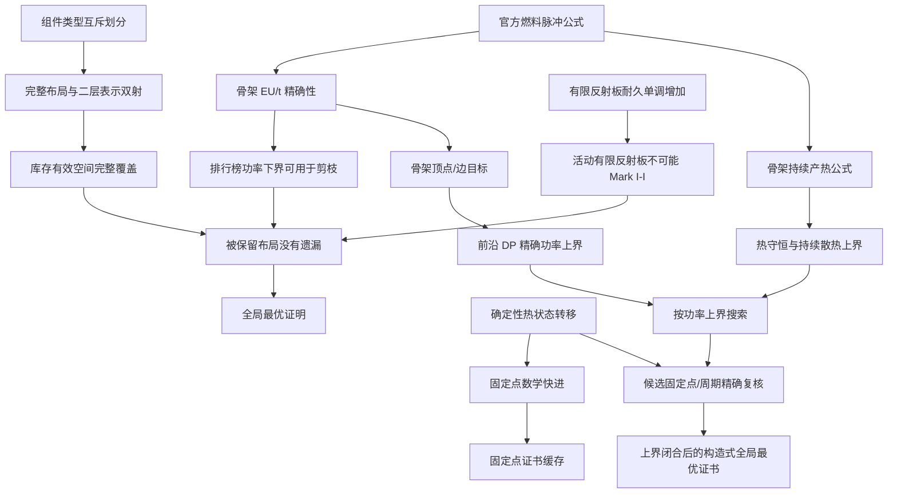

# Mark I 计算优化：数学证明、适用条件与程序映射

> 规则基准：IC2 Experimental 2.8.221 EU 模式。  
> 正式 LaTeX 证明稿：[MARK_I_OPTIMIZATION_PROOFS.tex](MARK_I_OPTIMIZATION_PROOFS.tex)。  
> 本文公式使用 GitHub 兼容的 `$$...$$` 数学块；不支持数学扩展的 Markdown 查看器可阅读同目录的 `.tex` 文件。

## 0. 结论总览

| 方案或猜想 | 结论 | 正确性依据 | 程序中的优化点 |
|---|---|---|---|
| 铀燃料产热与温度无关 | 成立，但邻接组件变化会改变脉冲 | 官方产热公式不含温度 | 发电骨架可独立计算 EU/t |
| Mark I 从第一周期起恒温 | 不成立 | 存在先升温再进入固定点的递推反例 | 不能只检查初始温度；必须比较完整状态 |
| 完整热状态满足固定点后可以快进 | 成立 | 确定性状态转移与数学归纳法 | `ReactorSimulator._fast_forward_fixed_state` |
| 发电骨架与冷却布局可以分层枚举 | 成立 | 完整布局与“骨架、冷却赋值”之间存在双射 | `_run_mark_i_two_level_shard` |
| 分层枚举不会漏掉 Mark I 最优解 | 成立 | 双射覆盖、精确功率和严格排行榜下界 | 骨架子树批量剪枝 |
| 分层枚举对所有输入都严格更快 | 不成立 | 无可剪枝布局时会增加分析开销 | 只能证明模拟数不增加，并给出严格加速条件 |
| 固定点证书可以跨镜像复用 | 不成立 | 镜像的官方行优先状态转移可能不同 | 缓存键保留完整有标签布局 |
| Mark I 中的隔板都能删除 | 不成立 | 隔板影响堆容量、换热比例和临界阈值 | 只允许经过条件证明的支配剪枝 |
| Mark I 最优布局一定来自原始最大功率骨架 | 不成立 | 最大功率骨架可能没有任何可行冷却完成 | 必须按“最大可实现骨架”优化 |
| 骨架同时精确决定功率和持续产热 | 成立 | 两者都只依赖燃料类型与脉冲邻接 | 可先做功率动态规划与热守恒剪枝 |
| 前沿动态规划可直接构造最大功率骨架 | 成立 | 网格目标仅含顶点项和相邻边项 | 拟实现；替代逐槽骨架枚举 |
| 约束合成结果可以直接当作 Mark I 证明 | 不成立 | 静态约束不包含全部顺序、取整和暂态 | 必须由精确状态转移复核 |

## 1. 适用范围与前提

本文的定理使用以下前提：

1. 仅讨论当前项目支持的铀燃料、EU 模式和组件集。
2. 反应堆采用 IC2 2.8.221 的两阶段、行优先、立即写回结算。
3. 优化器验证 Mark I 时开启自动续棒。
4. 排行榜唯一目标是平均发电功率 `EU/t`。
5. 不把爆炸抗性、造价、安全裕度或组件数量混入发电评分。
6. `proven_global` 只在全部骨架分片完成后成立；取消任务不能获得全局证明。
7. 二层生成器仅在请求的 Mark 集合恰好为 `['I']` 时启用；其他情况继续完整枚举。

## 2. 证明依赖结构



## 3. 状态模型与燃料产热

### 3.1 热学状态

以一个反应堆周期（20 game ticks）为离散时间单位，定义约化热状态：

$$
S_n=(H_n,L_n,C_n,D_n)
$$

其中：

- $H_n$：堆体热量；
- $L_n$：所有槽位的组件 ID；
- $C_n$：所有组件的内部热量；
- $D_n$：所有非燃料组件的耐久。

自动续棒时，燃料耐久不参与产热或发电公式；耗尽发生在当周期发电完成后，并换入同类新燃料。因此燃料耐久可以从用于固定点证明的约化热状态中排除。

固定布局定义确定性状态转移：

$$
S_{n+1}=F(S_n)
$$

由于槽位状态立即写回，$F$ 通常不是镜像不变函数。

### 3.2 燃料产热与功率

一根内部燃料棒具有 $p$ 个有效脉冲时，单根产热为：

$$
Q(p)=4\sum_{i=1}^{p}i=2p(p+1)
$$

$p$ 只由内部脉冲、相邻燃料和相邻有效反射板决定，公式中没有温度。因此温度不会直接改变铀燃料的产热。

若第 $j$ 个燃料组件包含 $r_j$ 根内部棒，自身内部脉冲为 $a_j$，相邻燃料或反射板数量为 $d_j$，且这些组件在 Mark I-I 中保持存在，则稳定发电功率为：

$$
P=5\sum_j r_j(a_j+d_j)\quad\text{EU/t}
$$

冷却组件不出现在这个公式中。这是发电骨架可以与冷却布局分离的基础。

### 3.3 恒定产热不意味着从初始状态起恒温

考虑：

```text
反应堆散热片 | 空槽 | 单联铀燃料棒
```

其余槽位为空，初始堆热为 0。散热片先结算旧堆热，燃料随后向堆体加入固定 4 热：

$$
H_{n+1}=\max(0,H_n-5)+4
$$

所以：

$$
H_0=0,\qquad H_1=4,\qquad H_n=4\ (n\ge 1)
$$

该布局先升温再恒定，仍属于 Mark I-I。由此可知，恒温证明必须检查完整状态转移，不能只检查燃料输入是否恒定。

## 4. 方案一：固定点证明与数学快进

### 子命题 A1：约化状态转移是确定的

给定布局、自动续棒设置和约化状态 $S_n$ 后，官方行优先算法唯一确定 $S_{n+1}$、当周期 EU/t 和所有非燃料事件。

### 子命题 A2：燃料耐久不改变约化转移

燃料耐久只决定当周期能量阶段结束后是耐久加一还是换入同类新燃料。两种情况都不改变下一周期中的燃料组件 ID、燃料热量或脉冲拓扑，因此不改变约化状态转移。

### 定理 A：固定点快进正确

若未发生临界、组件移除或融毁，并且：

$$
F(S_n)=S_n
$$

则对任意整数 $m\ge1$：

$$
F^m(S_n)=S_n
$$

**证明：** 已知 $F(S_n)=S_n$。若 $F^k(S_n)=S_n$，则：

$$
F^{k+1}(S_n)=F(F^k(S_n))=F(S_n)=S_n
$$

由数学归纳法，结论对所有 $m\ge1$ 成立。燃料和反射板拓扑不变，因此每周期 EU/t 也相同。证毕。

### 程序应用点

| 数学结论 | 程序位置 | 实际优化 |
|---|---|---|
| 比较约化状态 | `ReactorSimulator.state_signature` | 忽略不影响热学的燃料耐久 |
| 发现 $F(S)=S$ | `ReactorSimulator.simulate` | 不再逐周期执行热阶段和能量阶段 |
| 补算燃料耐久和续棒 | `ReactorSimulator._fast_forward_fixed_state` | 保留最终耐久、续棒事件和累计 EU |
| 保持原稳态确认时刻 | `ReactorSimulator.simulate` | 快进到原算法应比较的完整周期边界 |

### 不适用情况

- 状态只是堆热相同，但组件热量或非燃料耐久不同；
- 存在周期大于 1 的振荡状态；
- 没有自动续棒；
- 已发生临界、组件移除或融毁；
- 用户要求保存逐周期轨迹。

## 5. 方案二：发电骨架与冷却布局二层生成

### 5.1 组件划分

把组件 ID 集合划分为互不相交的两类：

$$
\mathcal P=\{\text{燃料、反射板}\}
$$

$$
\mathcal C=\{\text{散热、换热、储热、冷凝、隔板}\}
$$

并且：

$$
\mathcal P\cap\mathcal C=\varnothing
$$

### 5.2 发电骨架和冷却赋值

对任意完整布局 $L$，定义：

- $P(L)$：保留 $L$ 中的燃料和反射板，其余位置写为空槽；
- $C(L)$：只记录 $P(L)$ 空位中的冷却组件赋值。

### 定理 B1：二层表示与完整布局存在双射

映射：

$$
\Phi:L\mapsto(P(L),C(L))
$$

是双射。

**单射证明：** 若两个完整布局 $L_1\ne L_2$，则至少有一个槽位不同。若差异属于 $\mathcal P$，则 $P(L_1)\ne P(L_2)$；若差异属于 $\mathcal C$ 或空槽，则对应冷却赋值不同。因此 $\Phi(L_1)\ne\Phi(L_2)$。

**满射证明：** 给定合法骨架 $P$ 和其空位上的合法冷却赋值 $C$，把 $C$ 写回 $P$ 的空位即可唯一重建完整布局 $L$。因此每个合法二层表示都对应一个完整布局。

所以二层生成器既不会重复，也不会遗漏完整布局。证毕。

### 定理 B2：库存约束在分层后保持

燃料组件数量或燃料棒总数只在第一层扣减，并可采用“恰好”等式约束或“最多”上界约束；反射板数量同样只作用于第一层，冷却组件上限只作用于第二层。由于 $\mathcal P$ 与 $\mathcal C$ 不相交，两层计数之和等于完整布局中的组件计数，因此：

$$
L\text{ 满足库存约束}\iff P(L)\text{ 与 }C(L)\text{ 分别满足对应约束}
$$

### 5.3 冷却子树的精确组合数

设骨架有 $r$ 个空位，$k$ 种冷却组件的库存上限为 $c_1,\ldots,c_k$。选择数量 $n_i$ 后，该组合的有标签布局数是：

$$
\frac{r!}{(r-\sum_i n_i)!\prod_i n_i!}
$$

所以整个冷却子树大小是：

$$
N_C(r;c_1,\ldots,c_k)=
\sum_{\substack{0\le n_i\le c_i\\\sum_i n_i\le r}}
\frac{r!}{(r-\sum_i n_i)!\prod_i n_i!}
$$

程序使用等价动态规划计算该值，避免枚举每个 $n_i$ 组合和完整布局。

### 5.4 发电骨架功率的精确性

对于 Mark I-I，燃料、反射板和其他组件均不会被移除。EU/t 只由燃料和反射板脉冲决定，因此同一骨架的所有合法 Mark I-I 冷却完成布局具有相同 EU/t：

$$
\forall L_1,L_2,\quad P(L_1)=P(L_2)\land L_1,L_2\in\text{Mark I-I}
\Rightarrow \operatorname{EU}(L_1)=\operatorname{EU}(L_2)
$$

### 5.5 活动有限反射板的静态排除

有限反射板每次收到燃料热脉冲都会增加耐久损耗。若它与燃料相邻，则非燃料耐久严格增加，最终组件被移除。因此它既不能形成约化固定点，也不能无限期满足无组件损坏的 Mark I-I 条件。

所以该骨架的全部冷却子树都可以直接记为数学排除。

### 5.6 排行榜功率下界

设当前前十榜单第十名功率为 $\tau$。代码只在骨架功率 $p$ 满足以下严格不等式时剪枝：

$$
p<\tau
$$

已经存在 10 个不同规范布局组，其功率均不低于 $\tau$。同一骨架下任何 Mark I-I 冷却布局的功率都是 $p$，因此当 $p<\tau$ 时，该骨架不可能进入前十。

代码不剪枝 $p=\tau$ 的情况，所以相同功率下的规范布局稳定排序不会被遗漏。

### 定理 B3：二层生成器不会漏掉前十优解

对任意库存有效完整布局 $L$，由定理 B1，它会落入唯一的骨架和冷却赋值：

1. 若骨架含活动有限反射板，则 $L$ 不可能是 Mark I-I；
2. 若骨架功率低于已证明的第十名门槛，则 $L$ 不可能进入前十；
3. 其余骨架的所有冷却赋值都会被第二层生成并按官方热学逻辑验证。

因此所有可能进入 Mark I 前十的布局都被实际验证，不会漏算优解。证毕。

### 5.7 多进程共享门槛的安全性

第十名门槛只会保持或升高，不会降低。工作进程可能暂时看到旧的较低门槛，这只会多做热学模拟，不会错误剪枝。进程本地门槛来自该进程已经找到的 10 个不同规范组；这些候选同样是全局可行候选，因此本地门槛也可作为安全下界。

### 程序应用点

| 数学结论 | 程序位置 | 实际优化 |
|---|---|---|
| 提取 $P(L)$ | `power_skeleton` | 冷却组件不参与功率计算 |
| 精确计算骨架功率 | `skeleton_eu_per_tick` | 在热学模拟前获得 EU/t |
| 二层生成 | `_run_mark_i_two_level_shard` | 第一层骨架、第二层冷却赋值 |
| 计算 $N_C$ | `count_cooling_completions` | 整棵冷却子树批量计数 |
| 有限反射板证明 | `has_degrading_power_component` | 不生成不可能 Mark I-I 的冷却布局 |
| 榜单门槛 | `current_power_floor` | 低功率骨架整棵跳过 |
| 多进程共享 | `shared_power_floor` | 一个进程发现的门槛帮助其他进程 |
| 完整空间估计 | `estimate_exhaustive_space` | 最终核对 `checked` 是否覆盖完整空间 |

## 6. 二层生成器的性能证明

### 6.1 计数定义

定义：

- $N$：库存有效的完整有标签布局数；
- $S$：实际访问的发电骨架节点成本；
- $K$：实际构造到完整布局层的候选数；
- $M$：实际运行官方热学模拟的候选数；
- $B$：通过整棵子树计数跳过的完整布局数。

完整运行满足：

$$
N=K+B
$$

并且：

$$
M\le K\le N
$$

项目计数对应：

$$
\texttt{checked}=\texttt{evaluated}+\texttt{pruned}=N
$$

该等式只要求任务正常完成；取消任务允许停在部分计数状态。

### 6.2 模拟次数不会增加

旧算法对每个完整布局至多运行一次热学模拟，因此最多模拟 $N$ 次。新算法只对未被证明排除的完整布局模拟，所以：

$$
M\le N
$$

这是无条件成立的模拟次数上界。

### 6.3 完整布局构造次数也不会增加

整棵骨架子树被排除时，程序只计算组合数 $N_C$，不构造其中的完整布局。因此：

$$
K=N-B\le N
$$

只要至少有一棵非空冷却子树被批量排除，就有 $K<N$。

### 6.4 墙钟时间何时严格提升

设：

- $C_s$：骨架生成和功率分析的平均成本；
- $C_c$：构造一个完整冷却布局的平均成本；
- $C_t$：一次热学验证的平均成本；
- $C_o$：多进程通信和组合计数的额外成本。

旧算法近似成本：

$$
T_{\mathrm{old}}=N(C_c+C_t)
$$

新算法近似成本：

$$
T_{\mathrm{new}}=SC_s+KC_c+MC_t+C_o
$$

因此严格加速的充分必要比较条件是：

$$
(N-K)C_c+(N-M)C_t>SC_s+C_o
$$

这解释了两个不同结论：

- **可证明：** 热学模拟数和完整布局构造数都不会增加；
- **不可无条件证明：** 所有输入的墙钟时间都严格减少。

最坏情况下没有任何骨架可剪枝，$K=M=N$，新算法会增加骨架分析开销。最佳情况下，高功率可行骨架很早建立门槛，大量低功率骨架的全部冷却子树都由组合数直接跳过。

### 6.5 当前隔离基准

在一个包含 47,466 个完整布局的生成器隔离案例中：

```text
checked   = 47,466
evaluated =  7,398
pruned    = 40,068
```

即 84.4% 的完整布局没有进入热学验证。这个数字只证明该案例中的剪枝规模，不代表所有库存配置的统一加速比例。

## 7. 方案三：固定点证书与结果缓存

### 子命题 C1：精确键命中可以复用结果

缓存键包含：

```text
完整有标签布局 + 列数 + 最大反应堆周期
```

规则集在当前进程中固定。两个请求的键完全相同时，它们的确定性状态转移、停止条件和评分相同，因此可以复用已验证结果。

### 子命题 C2：镜像不能共享证书

镜像布局可能具有不同的行优先结算顺序，所以即使规范展示键相同，热学缓存键也必须不同。

### 子命题 C3：有界缓存不会无限增长

进程级结果缓存采用 LRU 上限；启发式任务另有任务级重复布局缓存。多进程一次性评估关闭工作进程结果缓存，避免把大量只出现一次的候选长期保留。

### 程序应用点

| 证书类型 | 程序位置 | 用途 |
|---|---|---|
| 进程级有界结果证书 | `_fixed_point_certificate` | 相同请求跨调用复用 |
| 启发式任务缓存 | `OptimizationJob._heuristic_cache` | 遗传算法重复布局不再模拟 |
| 发电骨架功率缓存 | `skeleton_eu_per_tick` 的 LRU | 多个冷却完成布局共享一次骨架功率 |

缓存只能减少重复工作，不能改变结果；完全没有重复键时，它不会带来命中收益。

## 8. 隔板的条件性结论

隔板不提供燃料或反射板脉冲，所以不直接增加 EU/t。但隔板改变最大堆热，最大堆热又参与堆体换热器比例和 85% 临界阈值。因此不能从所有 Mark I 候选中无条件删除隔板。

以下 2×3 子布局说明隔板与空槽不总是热学等价：

```text
元件散热片 | 超频散热片 | 反应堆散热片
双联铀燃料 | 高热容隔板 | 反应堆热交换器
```

| 项目 | 有高热容隔板 | 隔板替换为空槽 |
|---|---:|---:|
| 分类 | Mark I-I | Mark I-I |
| 平均输出 | 20 EU/t | 20 EU/t |
| 稳态堆热 | 24 | 24 |
| 反应堆热交换器热量 | 5 | 1 |
| 最大堆热 | 12,000 | 10,000 |

只有在没有读取堆容量的换热行为、去掉隔板后仍低于临界阈值，并忽略爆炸抗性时，才能进一步证明隔板对当前目标冗余。

## 9. 不同运行情况的处理矩阵

| 情况 | 二层生成 | 固定点快进 | 功率剪枝 | 证书复用 |
|---|---:|---:|---:|---:|
| 仅请求 Mark I，自动续棒 | 是 | 是 | 是 | 是 |
| 同时请求 Mark I 和其他 Mark | 否，使用完整枚举 | 可用于单布局 | 否 | 是 |
| 仅请求 Mark II–V | 否 | 通常不适用 | 否 | 是 |
| 保存完整逐周期轨迹 | 与优化器无关 | 否 | 与优化器无关 | 不复用无轨迹证书 |
| 活动有限反射板 | 第一层整棵排除 | 否 | 静态证明 | 可缓存最终结论 |
| 非活动有限反射板 | 保留骨架 | 可能 | 按正常功率 | 是 |
| 镜像布局 | 分别生成 | 分别证明 | 分别检查 | 不共享热学证书 |
| 任务被取消 | 保留部分结果 | 已完成候选有效 | 部分计数有效 | 已写入证书仍有效 |

## 10. 验证要求

相关回归测试至少覆盖：

1. 骨架公式与官方单联、双联、四联和反射板输出一致；
2. 活动有限反射板不能形成 Mark I-I；
3. 冷却子树组合数与直接枚举一致；
4. 二层生成后的 `checked` 等于完整空间估计；
5. 完整任务满足 `evaluated + pruned == checked`；
6. 多进程共享门槛不改变完整计数；
7. 镜像布局仍分别进行热学验证或上界证明；
8. 完整轨迹模拟与无轨迹固定点快进的 Summary 完全一致；
9. 证书缓存命中返回相同结果；
10. 排行榜评分严格只包含平均 EU/t。

当前验收命令：

```powershell
conda run -n ic2-reactor-optimizer pytest -q
npm run lint
npm run build
```

## 11. 构造式精确求解器的目标与实现状态

本节到第 15 节给出下一阶段求解器的程序契约、正确性证明和复杂度边界。它们是**拟实现算法的形式化设计**，不表示当前 `optimizer.py` 已经包含前沿动态规划或约束合成器。当前实现仍以第 5 节的二层完整生成器为准。只有新增实现通过第 15 节的交叉验证后，程序才能把对应结果标记为“构造式全局最优”。

新求解器首先限定为：

1. 只优化 Mark I；
2. 开启自动续棒；
3. 初始堆热和组件热量均为 0；
4. 目标只取排行榜第一名的平均 EU/t；
5. 可实现性与当前请求的 `max_reactor_ticks` 及精确模拟器语义一致；
6. 未能由数学证书排除的候选必须交给精确模拟器，必要时回退到完整生成，不能把“求解器超时”解释成“不可行”。

前五条固定了待优化的数学问题，第六条保证新增启发式、松弛模型或外部求解器不会破坏完备性。

## 12. 骨架同时决定功率与热负荷

### 12.1 精确公式

对第 $j$ 个燃料组件，记：

- $r_j$：组件内实际燃料棒数量；
- $a_j$：组件的内部脉冲数；
- $d_j$：相邻燃料或有效反射板数量；
- $q_j=a_j+d_j$：每根内部燃料棒的有效脉冲数。

则骨架的稳定功率和每个反应堆周期的总产热分别为：

$$
P(s)=5\sum_j r_jq_j
$$

$$
Q(s)=2\sum_j r_jq_j(q_j+1)
$$

第二个公式来自每根内部燃料棒的官方产热式 $4\sum_{i=1}^{q_j}i$。因此冷却组件既不改变 $P(s)$，也不改变骨架保持存在时的 $Q(s)$；它们只改变热量如何储存、搬运和排出。

### 12.2 最大功率骨架与最大可实现骨架

令 $\mathcal S$ 为满足库存约束的骨架集合，$\mathcal C(s)$ 为骨架 $s$ 的合法冷却完成集合。对给定验证边界 $T$，定义：

$$
\operatorname{Feas}_T(s)
\iff
\exists c\in\mathcal C(s),\quad
\operatorname{Accept}_T(s\oplus c)
$$

其中 $\operatorname{Accept}_T$ 表示当前精确模拟器在边界 $T$ 内把完整布局判定为 Mark I。

于是优化目标不是无约束骨架最大值，而是：

$$
\operatorname{OPT}_T=
\max_{s\in\mathcal S:\operatorname{Feas}_T(s)}P(s)
$$

设原始最大骨架功率为：

$$
P_{\max}=\max_{s\in\mathcal S}P(s)
$$

### 定理 D1：原始最大骨架可直接给出最优解的充要条件

$$
\operatorname{OPT}_T=P_{\max}
$$

当且仅当至少存在一个功率为 $P_{\max}$ 的骨架满足 $\operatorname{Feas}_T$。

**证明：** 若存在这样的骨架及冷却完成，则它达到所有骨架的统一上界 $P_{\max}$，故全局最优。反之，若 $\operatorname{OPT}_T=P_{\max}$，按最大值定义必有一个可实现骨架取得该值。证毕。

因此程序不能在唯一一个最大功率骨架冷却失败后结束，也不能假设所有同功率骨架的热学可实现性相同。

### 12.3 最小反例

库存为单联铀棒、铱反射板和普通散热片各一个时：

- 单铀邻接铱反射板：$P=10$ EU/t，$Q=12$；
- 普通散热片持续散热上限为 6；
- 总储热有限，所以该骨架不可能无限稳定；
- 不使用反射板时：$P=5$ EU/t，$Q=4$，普通散热片可以形成 Mark I-I。

因此该输入满足 $\operatorname{OPT}=5<P_{\max}=10$，直接否定“原始最大功率骨架必然可实现”。

## 13. 可实现性证书与安全排除

### 13.1 完整布局的固定点和周期证书

对完整布局 $L$，令 $F_L$ 为官方行优先、立即写回的一周期约化状态转移。若从初始状态沿安全前缀可达某个 $S$，且：

$$
F_L^k(S)=S
$$

并且这 $k$ 个周期内没有临界、非燃料组件损坏或融毁，则以后状态按周期 $k$ 无限重复，布局可无限安全运行。$k=1$ 就是当前固定点快进使用的最强常见证书。

**证明：** 对任意 $m\ge0$，由确定性有 $F_L^{mk}(S)=S$；周期内的每个中间状态也逐段重复。已验证的安全谓词因此对所有未来周期成立。证毕。

单周期固定点是充分条件而不是所有 Mark I 的必要条件。为了与当前程序语义保持一致，构造求解器找到的布局仍必须由 `ReactorSimulator` 从零热状态执行并获得当前边界 $T$ 下的 Mark I 结论；仅求得一个不可达的代数固定点不能作为有效见证。

### 13.2 全局热守恒排除

在没有组件移除的安全轨迹中，令 $E_n$ 为堆体与全部储热组件的总热量，$W_n$ 为第 $n$ 周期真正排向外界的热量，则：

$$
E_{n+1}=E_n+Q(s)-W_n
$$

换热器只搬运热量，冷却单元、冷凝模块和隔板只提供有限储热，均不产生永久热汇。设某个完整布局的持续外排上界为 $V(L)$，即 $W_n\le V(L)$。若：

$$
Q(s)>V(L)
$$

则 $E_n$ 至少线性增长，而安全状态的总储热有有限上界，产生矛盾。因此该布局不可能是 Mark I。

对尚未填冷却的骨架，可以在库存、槽位度数和组件参数下计算乐观上界 $\overline V(s)$。其中：

- 普通自散热片最多贡献其 `self_vent`；
- 元件散热片最多贡献 `side_vent` 乘以实际相邻可储热组件数；
- 反应堆/超频散热片的抽堆热只是搬运步骤，其永久外排仍不超过 `self_vent`；
- 换热器、储热单元、冷凝模块和隔板对持续外排上界贡献 0。

于是：

$$
Q(s)>\overline V(s)
\Longrightarrow
\neg\operatorname{Feas}_T(s)
$$

这个判据是严格必要条件，但 $Q(s)\le\overline V(s)$ 不是充分条件，因为实际布局还受邻接、行优先顺序、容量、比例取整和暂态峰值影响。

对只完成一部分的骨架，令 $Q_p$ 为已经固定的燃料/反射板产生的精确热量。以后加入新的发电组件只会增加既有燃料的有效脉冲，不会降低 $Q_p$。对任一满足剩余精确燃料约束的封装选择 $z$，令 $B(z)$ 为这些燃料在没有任何发电邻居时的固有产热，$F(z)$ 为新增燃料组件格数，则所有该选择下的完成都满足：

$$
Q_{\mathrm{final}}\ge Q_p+B(z)
$$

程序同时把每个未占用格都乐观视为可放入库存允许的最佳永久散热片：自散热贡献 `self_vent`，元件散热贡献至多 $4\cdot\texttt{side\_vent}$，并忽略所有邻接冲突。记剩余冷却格数对应的上界为 $U(z)$。若对所有合法封装选择都有：

$$
Q_p+B(z)>U(z)
$$

则该部分骨架的每个完成均违反持续热守恒，可以直接用 `count_remaining_layouts` 精确计数并关闭整棵子树。总棒数模式用有界背包同时保留“新增燃料格数—最低固有产热”的权衡，不能把单联燃料的低产热与四联燃料的低占格数错误组合成一个并不存在的完成。

### 13.3 约束松弛与精确复核

冷却合成器可以使用布尔变量 $x_{i,c}$ 表示槽位 $i$ 是否放置组件 $c$，并加入：

1. 每槽唯一组件；
2. 库存上限和骨架固定位置；
3. 持续散热、邻接度和剩余槽位下界；
4. 热源到储热/散热组件的乐观流量约束；
5. 已被精确模拟否决的完整布局 no-good 约束。

若这些约束是所有真实可行布局都必须满足的**必要条件松弛**，则松弛模型 `UNSAT` 可以安全证明无可行完成；`SAT` 只能产生候选，不能证明候选是真实 Mark I。候选必须经过精确模拟。

若外部求解器超时或返回 `UNKNOWN`，程序必须把对应分支保留为未决，并最终使用当前二层生成器完整验证。只有 `UNSAT` 证书、本文已证明的数学排除或精确模拟结果可以关闭分支。

当前程序已实现这一体系中的第一组必要条件证书：

- `skeleton_heat_per_tick` 精确计算 $Q(s)$；
- `_partial_mark_i_heat_infeasible` 在燃料骨架完成前联合剩余封装固有产热下界与拓扑无关散热上界，整棵关闭必然热失衡的部分骨架；
- `sustainable_vent_upper_bound` 在骨架层计算库存和剩余槽位下的乐观持续外排上界；
- `sustainable_heat_flow_upper_bound` 在完整冷却赋值层建立乐观最大流，保留燃料热源、散热上限、元件散热邻接、抽堆热和换热硬上限，同时放宽行优先顺序、热比例和容量；
- 只有“最大流仍小于产热”时才排除候选，最大流足够仍交给精确模拟。

换热器的堆体边上界不能简单取 `exchange_hull`。官方低百分比路径会使用 `exchange_side / 2`，普通热交换器可能在该分支交换 6 热而不是名义上的 4。因此程序取：

$$
v_{\mathrm{hull}}^{\max}=\max(\texttt{exchange\_hull},\lfloor\texttt{exchange\_side}/2\rfloor,1)
$$

这是乐观上界，避免因低估换热能力产生错误剪枝。

### 定理 D2：乐观最大流排除是可靠的

若完整布局存在安全周期轨迹，则在一个完整状态周期上，所有有限储热节点的净热量变化为 0。把每周期实际产热、搬运和外排量取时间平均，可得到从燃料热源到外界热汇、总流量为 $Q(s)$ 的守恒流。程序的热流网络保留所有实际通路的硬上限，并只增加有利方向、忽略比例/顺序限制，所以该平均流必然也是松弛网络中的可行流。因此：

$$
\operatorname{MaxFlow}(L)<Q(s)
\Longrightarrow
L\text{ 不可能形成安全周期}
$$

最大流达到 $Q(s)$ 只说明该必要条件通过，不能推出布局真实可行。

## 14. 前沿动态规划与带证书最优搜索

### 14.1 骨架目标的局部边表示

令网格为 $G=(V,E)$，骨架组件类型为 $t_v$。定义燃料顶点收益：

$$
b(t)=
\begin{cases}
5r_ta_t,&t\text{ 为燃料},\\
0,&\text{其他}.
\end{cases}
$$

对相邻组件 $s,t$ 定义边收益：

$$
w(s,t)=5\left[
\mathbf{1}_F(s)r_s\mathbf{1}_A(t)
+
\mathbf{1}_F(t)r_t\mathbf{1}_A(s)
\right]
$$

其中 $\mathbf{1}_F$ 表示燃料，$\mathbf{1}_A$ 表示燃料或反射板。于是：

$$
P(s)=\sum_{v\in V}b(t_v)+\sum_{(u,v)\in E}w(t_u,t_v)
$$

### 14.2 前沿状态与递推

按列逐格扫描高度 $h=6$ 的网格。令：

$$
D(i,F,\mathbf u)
$$

表示已经处理前 $i$ 个格子、前沿标签为 $F$、库存使用向量为 $\mathbf u$ 时的最大局部功率。放置新类型 $t$ 时只需增加：

$$
b(t)+w(t,t_{\mathrm{up}})+w(t,t_{\mathrm{left}})
$$

并更新前沿与库存。所有跨越“已处理/未处理”边界的网格边都以端点标签保存在 $F$ 中，所以未来收益只依赖 $(F,\mathbf u)$，不依赖已处理区域的具体内部布局。

### 定理 E1：前沿动态规划精确构造最大功率骨架

对每个状态只保留功率最大的前驱，最终最大状态值等于满足库存约束的 $P_{\max}$，沿前驱指针回溯得到一个取得 $P_{\max}$ 的骨架。

**证明：** 对处理格数 $i$ 归纳。$i=0$ 显然成立。假设所有 $i$ 格状态均保存相同边界和库存下的最优局部值。第 $i+1$ 格与过去只可能通过上、左两条已结算边相连，这两端标签均在状态中；其余未来贡献与过去内部布局无关。因此丢弃同状态的较小值不可能损失任何最优完整扩展。递推覆盖所有库存合法标签选择，归纳得到终态最优。证毕。

### 14.2.1 当前已实现的部分骨架乐观上界

当前实现采用两级功率上界。第一级 `optimistic_power_bound` 使用库存感知的定向脉冲松弛；第二级在列数不超过 4、剩余可变槽位不超过 18、功率组件类型不超过 6 时运行精确行优先前沿 DP。超出受控范围时只使用第一级上界，完整性不受影响。第一级上界为：

1. 已确定顶点和已闭合边使用精确功率；
2. 一条边的收益拆成两个燃料端点各自向“发电邻居”发出的定向脉冲；
3. 已处理燃料对每条跨越前沿的边都乐观假设未来端是燃料或反射板；
4. 未来固定燃料按实际格点度数计算，未来非固定燃料一律乐观赋予四个发电邻居；
5. 非固定燃料的选择服从剩余组件包约束；精确模式要求剩余目标最终全部满足，总棒数模式再用有界背包服从剩余棒数。反射板无需实际分配，因为所有燃料已经乐观假设四周均能产生邻接脉冲。

任意格点的实际度数不超过四，每条真实边的两个定向贡献都分别被上述项覆盖；库存背包又在所有合法剩余燃料选择中取最大值。因此：

$$
P(L)\le U_{\mathrm{partial}}
$$

只有 $U_{\mathrm{partial}}$ 严格低于当前第十名门槛时，程序才整棵排除该部分骨架。相等时不剪枝，以保留同功率规范布局组。

部分骨架被排除后不能丢失进度计数。设还有 $m$ 个非固定骨架位置，第 $t$ 种发电组件再使用 $n_t$ 个，则位置赋值数为：

$$
\frac{m!}{(m-\sum_t n_t)!\prod_t n_t!}
$$

程序按组件类型逐层乘以等价组合数，同时跟踪剩余精确组件数、总棒数和是否含燃料；精确模式只保留满足等式目标的终态，“最多”模式保留上界内终态。对每个最终骨架占用量再乘 `count_cooling_completions`。所以 `count_remaining_layouts` 精确等于被剪枝部分骨架下的完整有标签布局数，而不是估算值。

### 14.3 带上界的可实现骨架搜索

单独回溯一个 $P_{\max}$ 骨架并不完备，因为该骨架可能不可实现。完整算法维护按功率上界降序排列的未决子问题队列：

1. 用前沿动态规划计算每个子问题的精确骨架上界 $U$；
2. 取出 $U$ 最大的子问题并回溯一个最大骨架；
3. 应用有限反射板、热守恒、槽位和约束松弛证书；
4. 对 `SAT` 候选运行精确模拟，失败后加入 no-good；
5. 对 `UNKNOWN` 或无法证明的剩余分支回退到完整冷却生成；
6. 找到 Mark I 后更新当前可行下界 $P^*$；
7. 当所有未决子问题的最大上界 $U_{\max}\le P^*$ 时停止。

骨架子问题通过固定一个尚未决定的槽位类型或限制库存计数进行可由 DP 状态表达的分裂；冷却 no-good 只排除当前固定骨架下已经精确验证失败的冷却赋值，不改变骨架 DP 上界。只要子问题并集覆盖父问题且互不遗漏，具体分裂策略不影响正确性，只影响效率。

### 定理 E2：构造式求解器的全局最优性

假设：

1. 前沿动态规划给出的 $U$ 是对应子问题的精确功率上界；
2. 所有静态排除和 `UNSAT` 结论都是可行集合的必要条件证书；
3. 所有可行见证均通过当前精确模拟器验证；
4. 每个未被证明排除的分支最终被精确验证或继续保留为未决。

则算法在 $U_{\max}\le P^*$ 时返回的布局是给定边界 $T$ 下的全局最优 Mark I。

**证明：** 任意尚未验证的可行布局必属于某个未决子问题，其功率不超过该子问题上界，继而不超过 $U_{\max}\le P^*$。已关闭分支要么由可靠证书证明不可行，要么其功率上界也不超过下界。返回布局已经由精确模拟证明可行且功率为 $P^*$，所以不存在功率更高的可行布局。证毕。

### 14.4 完备性边界

固定点方程、热守恒和静态流量模型本身都不完备；只依赖它们会漏掉先升温后稳定或周期大于 1 的合法布局。算法的完备性来自第 5 步的精确回退，而不是来自松弛模型。若产品模式选择关闭回退，则结果只能标记为“已找到的最佳证书布局”，不得设置 `proven_global=true`。

## 15. 效率证明、实现契约与验收

### 15.1 骨架动态规划复杂度

设槽位数 $n=hw$，高度 $h=6$，允许的骨架标签数为 $k$，库存使用向量可能值总数为：

$$
B\le\prod_{t=1}^{k}(c_t+1)
$$

前沿最多保存 $h$ 个标签，因此状态数上界为 $Bk^h$；每个状态尝试至多 $k$ 个新标签。时间和内存上界分别为：

$$
T_{DP}=O(nBk^{h+1}),\qquad M_{DP}=O(Bk^h)
$$

直接骨架枚举忽略库存剪枝时为 $O(k^n)$。在反应堆高度固定为 6、组件种类固定时，前沿动态规划消除了对列数 $w$ 的指数项。这是骨架上界计算的严格渐近改进；它不等价于证明整个热学可实现性问题是多项式时间。

### 15.2 精确模拟次数

令：

- $N$：完整库存有效布局数；
- $M$：新算法实际执行精确热学模拟的不同布局数；
- $B_c$：由功率上界、数学证书或可靠 `UNSAT` 结论关闭、因而无需模拟的完整布局数。

若实现保证不重复模拟相同有标签布局，并对所有未决分支保留完整回退，则概念上有：

$$
N=M+B_c,\qquad M\le N
$$

只要 $B_c>0$，就有 $M<N$。这证明精确模拟次数严格减少，但不自动证明墙钟时间严格减少，因为动态规划和约束求解也有成本。

设一次模拟平均成本为 $C_t$，动态规划、约束求解和调度总额外成本为 $C_o$，则相对完整模拟的严格加速条件是：

$$
(N-M)C_t>C_o
$$

相对当前二层生成器比较时，还应把被省去的骨架递归和完整布局构造成本计入左侧。最坏情况下所有高功率骨架都难以判定且证书无效，新算法仍可能回退到组合搜索，因此文档和界面不得承诺所有输入都严格加速。

### 15.3 程序实现契约

新增实现必须满足：

1. DP 状态包含所有跨前沿标签和完整库存使用量；
2. DP 上界不得使用可能低估真实功率的启发式；
3. 热学松弛只能在 `UNSAT` 时排除，`SAT` 必须精确复核；
4. `UNKNOWN`、超时和取消均不得转化为不可行；
5. no-good 必须只排除已经验证失败的准确赋值或具有单独证明的赋值类；
6. 镜像布局不得共享热学可行证书；
7. 只有队列上界闭合且不存在未决分支时才能设置 `proven_global`。

### 15.4 新增验收测试

除第 10 节已有测试外，构造式求解器至少需要：

1. 在 2×N 和 3×N 缩小网格上逐实例比较 DP 与暴力骨架最大值；
2. 随机骨架的 $P(s)$、$Q(s)$ 与单周期模拟输出逐项一致；
3. 固定验证“单铀 + 铱反射板 + 普通散热片”的最大骨架不可实现反例；
4. 对随机小库存比较新求解器与现有完整枚举的最优功率和布局可行性；
5. 重放每个固定点/周期证书并验证所有中间状态安全；
6. 人工令约束求解器返回 `UNKNOWN`，确认回退后仍得到与完整枚举相同结果；
7. 人工构造错误 no-good，确认独立证书检查拒绝它；
8. 验证 `proven_global` 只在 $U_{\max}\le P^*$ 且无未决分支时出现；
9. 分别报告 DP 状态数、约束节点数、精确模拟数和墙钟时间，不能只报告最终耗时；
10. 保留一个几乎无法剪枝的反例，验证程序不会声称无条件加速。

### 15.5 第一阶段实现基准

库存为“单铀 ×1、铱反射板 ×1、普通散热片 ×1”的 3 列任务共有 5,526 个完整有标签布局。相同环境、单工作进程和 40,000 反应堆周期边界下：

| 实现 | `checked` | `evaluated` | `pruned` | 最优值 | 墙钟时间 |
|---|---:|---:|---:|---:|---:|
| 加入热学证书前 | 5,526 | 5,526 | 0 | 5 EU/t | 约 70.9 s |
| 热守恒与乐观热流证书 | 5,526 | 802 | 4,724 | 5 EU/t | 约 1.0 s |

该案例中精确模拟次数减少约 85.5%，完整空间计数和最优值保持不变。这个基准只证明第一阶段证书在该输入上的实际收益，不代表所有库存配置都能获得相同比例；无可排除布局时仍会增加最大流计算开销。

## 16. 枚举器第一阶段优化的等价性证明

本节证明 2026-07 第一阶段枚举优化只减少重复工作或提前发现已有证书，不改变合法布局集合、排行榜语义与全局证明条件。

### 16.1 行优先增量功率的精确性

由 14.1 节，骨架功率可以写成顶点项与无向网格边项之和：

$$
P(s)=\sum_{v\in V}b(t_v)+\sum_{(u,v)\in E}w(t_u,t_v)
$$

程序按行优先处理槽位。安装位置 $i$ 的组件时，`_partial_skeleton_power_increment` 加入：

1. 顶点项 $b(t_i)$；
2. 与左邻居的边项；
3. 与上邻居的边项。

每个顶点恰好在自身被处理时加入一次。任意水平边在其右端点被处理时恰好加入一次，任意垂直边在其下端点被处理时恰好加入一次；不存在其他网格边。因此处理完全部槽位后，增量和严格等于 $P(s)$。所以完整骨架可直接复用递归维护的 `current_power`，不必再次扫描骨架。

### 16.2 精确棒数可达性

对单联、双联、四联燃料，令剩余库存分别为 $c_1,c_2,c_4$。定义二元生成函数：

$$
G(x,y)=
\prod_{r\in\{1,2,4\}}
\left(\sum_{n=0}^{c_r}x^n y^{rn}\right)
$$

其中 $x$ 的指数表示占用槽位数，$y$ 的指数表示燃料棒数。存在一个使用不超过 $m$ 个槽位且恰好补足 $R$ 根燃料棒的封装，当且仅当：

$$
\exists s\le m,\quad [x^s y^R]G(x,y)>0
$$

`_bounded_fuel_rods_reachable` 的第 $s$ 个整数是一个棒数 bitset。初态只有 $(s,R)=(0,0)$；处理棒数为 $r$、上限为 $c_r$ 的燃料类型时，枚举 $0\ldots c_r$ 个组件并执行位移 $nr$。对燃料类型数归纳可知，处理结束后 bitset 中置位的 $(s,R)$ 与 $G$ 的非零系数完全相同。

所以函数返回 `False` 时不存在满足精确总棒数约束的后代。该分支不属于 `estimate_exhaustive_space` 计数的合法空间，可以直接停止而不增加 `checked` 或 `pruned`。

### 16.3 活动有限反射板的单调提前剪枝

设部分骨架中已经固定一条边 $(u,v)$，其中 $u$ 为燃料，$v$ 为有限耐久反射板。后续递归只给尚未决定的槽位赋值，不会修改 $u$、$v$ 或删除边 $(u,v)$。因此每个完整后代都保留该活动有限反射板。

按 5.5 节，活动有限反射板在燃料脉冲下耐久严格增加，最终被移除，不能形成无非燃料组件损坏的 Mark I-I 固定状态。于是：

$$
\text{partial skeleton contains an active finite reflector}
\Longrightarrow
\forall L\text{ below it},\quad L\notin\text{Mark I-I}
$$

`_forms_degrading_power_edge` 在新放燃料或有限反射板时检查新形成的边；预先固定位置之间的边在根状态检查。任意活动边要么两端都预先固定，要么在较晚端点被安装时被发现，因此不会漏检。被关闭分支仍由 `count_remaining_layouts` 精确计数。

### 16.4 子树计数缓存的状态充分性

在一个固定 shard 内，请求参数、固定槽位、组件总上限和冷却库存均为常量。对扫描位置 $i$ 的部分骨架，未完成合法布局数只依赖：

$$
(i,\mathbf c,R,h)
$$

其中 $\mathbf c$ 是剩余发电组件库存，$R$ 是当前棒数，$h$ 表示当前是否已有燃料。原因如下：

1. 位置 $i$ 唯一确定剩余非固定有标签槽位数；
2. $\mathbf c$ 唯一确定各发电组件还能使用的数量；
3. $(R,h)$ 唯一确定燃料等式与非空燃料条件；
4. 对每个最终发电占用数量，冷却后代数只依赖剩余空槽数和固定冷却库存，由 `count_cooling_completions` 给出。

骨架几何会影响功率、产热和可行性，但不会影响这个被剪分支下的**有标签组合数**。因此相同 $(i,\mathbf c,R,h)$ 的 `count_remaining_layouts` 返回值相同；记忆化只复用同一整数，不合并或删除任何不同布局。

### 16.5 未来功率背包缓存与上界保持

部分骨架的功率上界被拆为三项：

$$
U=P_{\mathrm{closed}}+U_{\mathrm{cross/fixed}}+U_{\mathrm{inventory}}
$$

- $P_{\mathrm{closed}}$ 是已处理顶点和闭合边的精确功率；
- $U_{\mathrm{cross/fixed}}$ 对跨前沿边和未来固定燃料作乐观估计；
- $U_{\mathrm{inventory}}$ 假设每个未来非固定燃料都获得最多四个发电邻居，并服从剩余槽位、库存和棒数约束。

第三项不读取已处理区域的具体几何，只依赖“剩余可变槽位数、剩余棒数、剩余库存向量”，所以可按这三个量记忆化。精确总棒数模式只保留棒数恰好等于剩余目标的背包终态；所有合法后代本来就必须属于这些终态，因此不会低估任何合法后代。

网格顶点实际度数不超过四；跨前沿边只被额外假设为发电边；未来固定燃料也按其实际格点度数的全活动情况估计。因此仍有：

$$
\forall L\text{ below the partial skeleton},\quad P(L)\le U
$$

程序仍只在 $U<\tau$ 时按排行榜下界剪枝，相等时保留。

### 16.6 占用掩码散热缓存的等价性

`sustainable_vent_upper_bound` 只读取：空槽集合、列数和冷却库存。非空槽究竟放单联燃料、四联燃料还是反射板，不参与空槽自由度和散热片乐观贡献的计算。因此若两个骨架具有相同空槽掩码 $M$：

$$
M(s_1)=M(s_2)
\Longrightarrow
\overline V(s_1)=\overline V(s_2)
$$

改用 `(free_mask, slots, columns, cooling_caps)` 作为缓存键只合并相等的数学输入，不共享热学模拟证书。

### 16.7 延迟共享下界读取的安全性

排行榜第 $K$ 名下界 $\tau(t)$ 随时间单调不下降。工作进程缓存的共享值 $\hat\tau$ 来自过去某一时刻，所以：

$$
\hat\tau\le\tau(t)
$$

若程序用缓存值关闭功率上界为 $U$ 的分支，则：

$$
U<\hat\tau\le\tau(t)
$$

该分支必然也低于当前真实下界。延迟读取只可能因为 $\hat\tau$ 偏低而少剪枝、多计算，不可能误剪。实现每 4096 个搜索节点刷新一次共享值；进程本地精确候选仍立即进入本地排行榜。

### 16.8 已验证布局的库存保持 warm start

随机满布局 warm start 若得到至少一个精确模拟确认的 Mark I 布局 $L$，程序会交换其中两个不同槽位来构造变体 $L'$。交换是布局多重集合上的置换，因此对每个组件类型 $c$ 都有：

$$
\operatorname{count}_c(L')=\operatorname{count}_c(L)
$$

所以燃料棒数、各组件库存和槽位数约束全部保持。优先交换非燃料/非反射板位置时，发电骨架也保持不变；若没有这样的不同槽位，允许退化为任意两个不同组件的位置交换，但仍保持库存。

变体不会因来源布局可行而被假定可行。每个 $L'$ 都从初始状态经过与普通候选完全相同的精确模拟，只有实际获得 Mark I 结论后才进入排行榜。于是排行榜中的每个 warm-start 候选都是可行见证，其第 $K$ 名功率仍是全局最优值的可靠下界。失败变体只被忽略，不产生剪枝结论。

warm start 不从待枚举空间中删除布局；完整穷举之后仍会再次覆盖这些布局。因此它只可能更早提高安全下界并增加后续功率剪枝，不改变完备性或最终计数。

### 16.9 全局证明不变量

以上优化后仍保持：

1. 棒数不可达分支不属于合法枚举空间；
2. 有限反射板、热守恒和功率上界分支均用任意精度整数精确计入 `pruned`；
3. 未被证书关闭的完整布局仍进入乐观最大流或精确模拟；
4. 取消、异常和未知结果不计为数学排除；
5. 相同功率仍使用严格不等式，不省略可能改变 canonical Top-K 的布局。

因此任务正常闭合时继续满足：

$$
\texttt{checked}=\texttt{evaluated}+\texttt{pruned}
=\texttt{estimate\_exhaustive\_space(request)}
$$

`proven_within_horizon` 与 `proven_global` 的成立条件不变。

## 17. 部分冷却布局散热上界

本节证明第二阶段加入的 `_partial_sustainable_vent_upper_bound` 只会排除不可能形成稳态热平衡的冷却前缀。该上界只在库存中存在 `side_vent > 0` 的元件散热片时周期性计算；纯自散热库存继续使用原有低成本路径。

### 17.1 名义散热容量

对完整冷却布局 $L$，令 $V(L)$ 为忽略热量能否送达散热片之后的名义每 tick 散热容量：

$$
V(L)=
\sum_{v\in\mathcal V(L)}a_v+
\sum_{v\in\mathcal V(L)}
\sum_{c\in N(v)\cap\mathcal C(L)}b_v
$$

其中 $\mathcal V(L)$ 是散热片集合，$\mathcal C(L)$ 是可被元件散热片冷却的组件集合，$a_v$ 是 `self_vent`，$b_v$ 是 `side_vent`。游戏规则中每个自散热和邻接散热通道都不能超过对应硬上限，所以任意真实长期平均排热量 $Q(L)$ 满足：

$$
Q(L)\le V(L)
$$

因此只需构造对所有后代的共同上界 $U\ge V(L)$；若骨架产热 $H>U$，则任何后代都不可能满足长期热平衡。

### 17.2 自散热上界

设未决槽位集合为 $D$。已放置散热片的自散热贡献是精确常数。对剩余库存中的每个散热片副本记录 $a_v$，允许这些副本忽略位置冲突，并取其中最大的 $|D|$ 个值。记所得总和为 $U_{self}$。

任意后代至多在 $D$ 中再安装 $|D|$ 个散热片，其自散热值构成上述候选多重集合的一个子集，所以：

$$
\sum_{v\in\mathcal V(L)}a_v\le U_{self}
$$

### 17.3 以散热片为中心的邻接上界

令 $C_f$ 为已经固定的可冷却位置。若剩余库存中还有可冷却组件，则把每个未决位置都暂时视为可能可冷却；否则未决位置都不能提供可冷却邻居。记这一乐观集合为：

$$
C^+=
\begin{cases}
C_f\cup D,&\text{剩余可冷却组件数}>0\\
C_f,&\text{否则}
\end{cases}
$$

对已放置散热片 $v$，使用 $b_v|N(v)\cap C^+|$。对每个剩余散热片副本，允许它单独占据使 $|N(v)\cap C^+|$ 最大的位置，再从这些候选值中取最大的 $|D|$ 个。所得邻接上界记为 $U_V$。

真实后代中的每个可冷却邻居都属于 $C^+$；每个未来散热片的位置也属于求最大值时考虑的 $D$。忽略不同散热片争夺同一位置只会增加结果。因此：

$$
\sum_{v\in\mathcal V(L)}b_v|N(v)\cap\mathcal C(L)|\le U_V
$$

### 17.4 以可冷却组件为中心的邻接上界

还可以从每个被冷却组件接收多少条邻接散热边来计数同一个总和。

对固定可冷却位置 $c\in C_f$：

1. 已放置邻接散热片的 $b_v$ 精确计入；
2. 对尚未决定的邻居数 $|N(c)\cap D|$，从剩余散热片副本中取相同数量的最大 `side_vent`；
3. 不同固定位置可以重复使用同一个未来副本，这是有意的松弛。

未来可冷却组件数量至多为：

$$
m_C=\min\left(|D|,\sum_{t\in\text{coolable}}c_t\right)
$$

网格度数不超过 4。把已放置散热片和至多 $|D|$ 个未来散热片副本的 `side_vent` 值放入多重集合，令其中最大的四个之和为 $B_4$。每个未来可冷却组件接收的邻接散热不超过 $B_4$，所以未来部分不超过 $m_CB_4$。固定部分与未来部分之和记为 $U_C$，于是：

$$
\sum_{v\in\mathcal V(L)}b_v|N(v)\cap\mathcal C(L)|\le U_C
$$

同一个真实邻接散热量同时不超过 $U_V$ 和 $U_C$，故可取更紧的共同上界：

$$
U_{side}=\min(U_V,U_C)
$$

最终：

$$
\forall L\text{ below the cooling prefix},\qquad
Q(L)\le V(L)\le U_{self}+U_{side}=U
$$

所以程序仅在严格不等式 $H>U$ 成立时关闭剩余子树，不会误删任何可持续 Mark I 后代。

### 17.5 缓存状态的充分性

该上界的输入状态为：

$$
(D,C_f,\mathbf M_V,\mathbf c_V,m_C,w,n)
$$

其中 $D$ 是未决位置掩码，$C_f$ 是固定可冷却位置掩码，$\mathbf M_V$ 是各散热片类型的已放置位置掩码，$\mathbf c_V$ 是剩余散热片库存，$m_C$ 是剩余可冷却组件总数，$w,n$ 分别是列数和槽位数。

公式不读取非散热片组件的具体身份：对它而言，冷却单元和交换器只有“可冷却”这一布尔属性；空槽、隔板和冷凝器都属于不可冷却类。因此相同状态严格产生相同上界。缓存只复用必要条件的整数结果，不合并完整布局，也不共享精确模拟结果。

### 17.6 周期检查和计数守恒

为了避免在几乎无剪枝收益的输入上让上界计算反客为主，递归只在根、叶以及每四层前缀检查一次，并且仅对含邻接散热片的库存启用。少检查节点只能漏掉某些可安全剪枝机会，不会产生新剪枝，更不会影响正确性。

若一个前缀被关闭，`count_cooling_completions` 使用未决槽位数和精确剩余库存计算该子树的全部有标签后代数 $B$，并执行：

$$
\texttt{checked}\mathrel{+}=B,\qquad
\texttt{pruned}\mathrel{+}=B
$$

未关闭叶节点仍进入最大流必要条件或精确模拟。因此第二阶段继续保持：

$$
\texttt{checked}=\texttt{evaluated}+\texttt{pruned}
$$

### 17.7 为什么暂不合并完整冷却前沿

名义散热上界可以忘记非散热片组件身份，但精确 IC2 热学转移不能：交换器类型、热容量、行优先处理顺序和历史热状态都会影响结果。仅按局部前沿相同就合并完整后代，没有足够的等价性证明。

因此本阶段只缓存经过证明充分的“上界状态”，不把不同完整布局合并为一次模拟。若后续实现精确热学前沿 DP，其状态至少必须包含跨前沿组件类型、库存向量和足以恢复周期热状态的变量；在此之前，保留逐布局精确复核是必要条件。

## 18. 受控骨架功率前沿 DP

本节证明 `exact_future_power` 返回当前部分骨架在库存和燃料约束下能够取得的精确最大剩余功率。实现仍然保留第一级定向脉冲松弛：只有松弛上界尚不能剪枝，并且状态规模位于受控范围内时才调用前沿 DP。

### 18.1 前沿状态

按行优先顺序处理槽位。处理位置 $i$ 之前，令 $F=(F_0,\ldots,F_{w-1})$ 保存每一列最后一个已处理标签。在当前行列号为 $c$ 时：

- 若 $c>0$，左邻居标签是 $F_{c-1}$；
- 若 $i\ge w$，上邻居标签是 $F_c$；
- 放置新标签 $t$ 后，用 $t$ 替换 $F_c$。

网格中尚未结算、且连接已处理区域与未来区域的边，其已处理端点全部位于该前沿。更早的内部顶点不再与任何未来顶点相邻。因此未来功率只需要前沿标签，不需要完整历史布局。

完整 DP 状态写为：

$$
D(i,F,\mathbf c,R,h)
$$

其中 $\mathbf c$ 是剩余功率组件库存，$R$ 是总棒数模式下的剩余棒数预算，$h$ 表示当前是否已经含有燃料。预先固定的 shard 位置是单元素选择集；普通位置可以选择空槽或任意库存仍为正的功率组件。

### 18.2 精确递推

令顶点功率为 $b(t)$，无向网格边功率为 $w(a,t)$。对当前位置允许的标签集合 $A_i$，递推为：

$$
D(i,F,\mathbf c,R,h)=
\max_{t\in A_i}
\left[
b(t)+w(F_{c-1},t)+w(F_c,t)
+D(i+1,F[c\leftarrow t],\mathbf c-\mathbf e_t,R-r_t,h\lor fuel(t))
\right]
$$

不存在左邻居或上邻居时，对应边项取零。空槽不消耗库存，预先固定位置也不再次消耗库存或棒数，因为这些数量已经在 shard 根状态扣除。

终态仅在以下条件成立时返回零，否则返回 $-\infty$：

1. 至少存在一个燃料组件；
2. `separate + exact` 模式下所有剩余燃料库存均为零；
3. `total_rods + exact` 模式下 $R=0$。

总棒数精确模式还在中间状态调用有界 $1/2/4$ 棒包装可达性判断；这只删除无法到达合法终态的 DP 状态。

### 18.3 精确性的归纳证明

对剩余槽位数 $n-i$ 归纳。

当 $i=n$ 时，没有未来顶点或边。终态条件恰好是剩余全局燃料约束，所以返回值严格等于该状态合法完成的最大附加功率：合法时为零，无合法完成时为 $-\infty$。

假设所有 $i+1$ 状态都返回对应后代的精确最大附加功率。在位置 $i$，任意合法完整后代都有唯一首标签 $t\in A_i$。该标签新结算一个顶点项，以及与左、上两个已处理邻居的边项；其余功率全部属于更新后的 $i+1$ 状态。递推枚举全部合法 $t$ 并取最大值，因此既不会遗漏任何完成，也不会引入库存或棒数非法的完成。由归纳法：

$$
D(i,F,\mathbf c,R,h)
=
\max_{L\text{ completes the prefix}}
\bigl(P(L)-P_{processed}\bigr)
$$

于是程序计算的：

$$
U_{DP}=P_{processed}+D(i,F,\mathbf c,R,h)
$$

是库存合法骨架完成的精确最大功率。DP 没有额外要求有限反射板可持续，也没有施加热学可行性，所以相对于最终 Mark I 可行集仍然是安全上界。

### 18.4 Top-K 剪枝

设当前已经精确模拟确认的 Top-K 功率下界为 $\tau$。任意当前前缀后代 $L$ 都满足：

$$
P(L)\le U_{DP}
$$

因此仅当严格不等式：

$$
U_{DP}<\tau
$$

成立时才关闭整棵子树。相等功率仍然保留，以免遗漏可能改变 canonical Top-K 的布局。被关闭子树继续由 `count_remaining_layouts` 精确折算全部冷却后代，所以计数恒等式保持不变。

### 18.5 复杂度边界和降级策略

设前沿宽度为 $w$，功率标签数为 $k$，库存状态组合数为 $B$，棒数预算状态数为 $R+1$。最坏状态数上界为：

$$
O\left(nk^wB(R+1)\right)
$$

每个状态最多尝试 $k$ 个标签。该界仍可能很大，因此当前实现只在以下条件同时满足时启用：

1. `columns <= 4`；
2. 剩余可变槽位不超过 18；
3. 功率组件类型不超过 6。

缓存最多保留 65,536 个状态。超出范围或尚未形成 Top-K 下界时不运行 DP，继续使用原有定向脉冲上界和完整 DFS。跳过一个上界检查只会减少剪枝，不会改变搜索空间或最优性证明。

### 18.6 可观测统计

每个 Mark I shard 返回：DP 调用数、缓存命中/未命中数、DP 剪枝节点及其折算布局数，以及第一级松弛上界对应的剪枝数量。主任务汇总后通过 `power_frontier_stats` 暴露。统计只在已经决定剪枝后增加计数，不参与任何剪枝判断。
